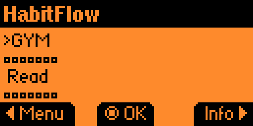
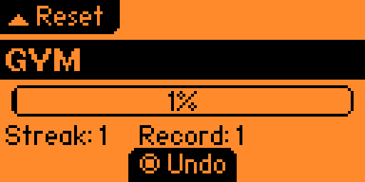

# HabitFlow

Offline habit tracker for [Flipper Zero](https://flipperzero.one/): create habits with a day-based goal (1–365, default 66), mark today done from the device, follow streaks and progress toward “mastered,” and keep everything on the SD card. When the date rolls forward, the app can ask whether you finished yesterday so streaks update in a deliberate way instead of silently dropping.

## Features

- Dashboard with scrollable habits and a small recent-activity strip per habit (filled = completed, frame = missed).
- Habit detail: progress toward goal, streak and best streak, optional medal after mastery, OK to toggle today, Up to reset streak (with confirm), Back to dashboard.
- Manage habits (Left from dashboard): add, edit name and goal (1–365 days), save, delete.
- Calendar handling on launch: single-day gap with unfinished yesterday opens Yes/No per habit; longer gaps reset streaks and clear the bar.
- Data stored on SD at `/ext/apps_data/habitflow/habitflow.bin` (auto-saved on each change).

## Screenshots

| Main list | Habit detail |
| --- | --- |
|  |  |

## Build

Requires a local [flipperzero-firmware](https://github.com/flipperdevices/flipperzero-firmware) tree.

```bash
export FLIPPER_FIRMWARE_PATH=/path/to/flipperzero-firmware
make prepare
make fap
```

Host tests, format, and static analysis:

```bash
make test
make format
make linter
```

## Development

This project mirrors the layout used in other Flipper apps in this workspace: `include/` / `src/`, `application.fam`, `Makefile`, `.clang-format`, GitHub Actions CI, and release-please for versioning.
